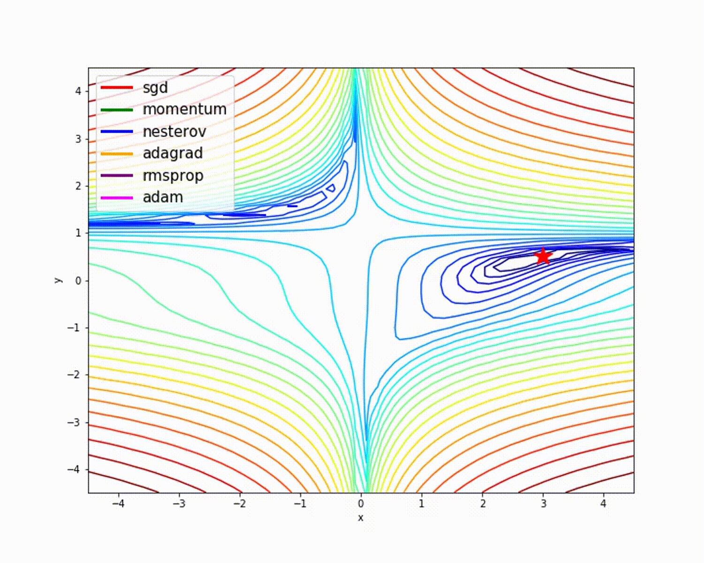
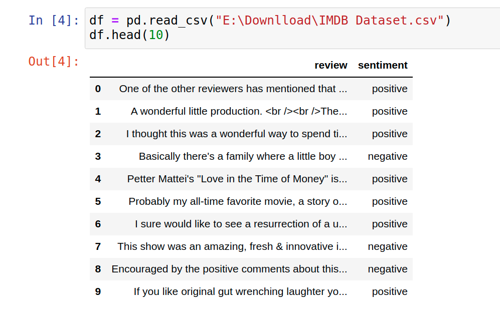
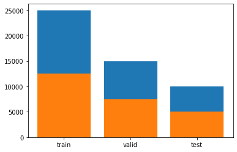
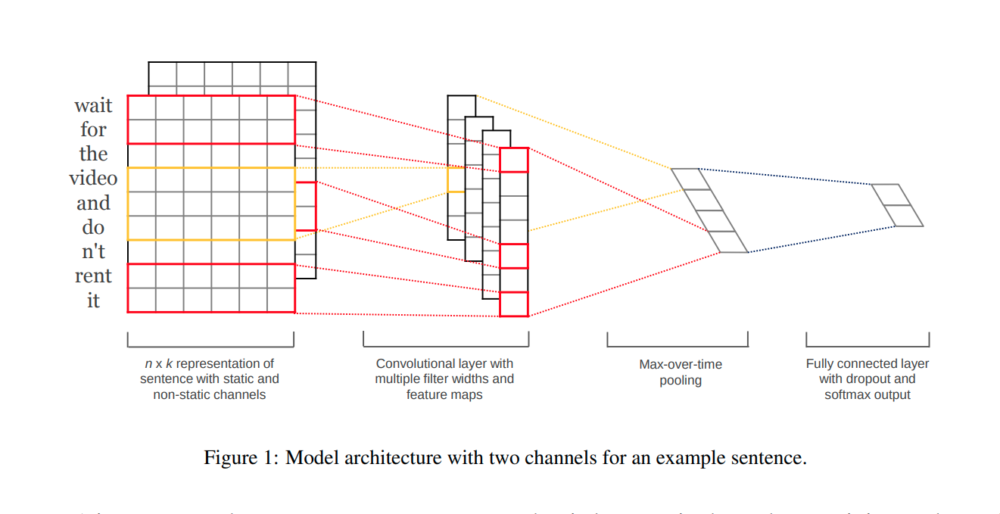

# Playing-With-Optimizers-in-DL
Using different optimizers for a comparison study, finding the root of differences by visualization and to find the best case for a specific task

[[GIF credit](https://www.analyticsvidhya.com/blog/2021/06/guide-to-gradient-descent-and-its-variants-with-python-implementation/)]

` - Note: In an another repo we discuss about different optimization algorithms with visualiation on different function by simulation but here we take a real life dataset and apply different Well Known optimizers for optimizinig loss function ` 

# Contents:
 1. Our main goal
 2. About the Task
 3. About the Dataset
 4. About the model ( we will use for )
 5. Comparision Study and regarding Explaination with code
 - **1.  Discussion with Theory of each optimizers**
     - SGD ( vanila and MINI Batch )
     - SGD with momentum (including Nestrove )
     - Adagrad ( adaptive previous gradient to control LR )
     - RMSprop ( making the lr automatically adjusted )
     - Adadelta ( modification of Adadelta )
     - Adam ( )
 
 
# Our main Goal :
We have seen that for convex loss function it is easy to get the minimum point by GD or anyother modification of that but in case of non-convex loss function it's too hard to get the global minima. And we have also seen that all the DL models having non-linearity results in non-convex loss function having many local minima and sadle points. So vanila-GD will not work here and we need more modification of that. There are few well known modifications such as Nestrove, Adagrad, RMSprop, Adadelta, Adam, etc.But none of these are perfect for any kind of loss functions. But some of them works well in most cases. Here we will see which one will be better for our specific task. The task is described below-
            
# About the Task:
  Here we will take text classification as our task to implement all the different optimizers. We shall take an inbuild dataset from tenserflow ( named imdb ). Then shall build a simple model ( named TextCNN ). After preprocessing and seperating test and validation data from training data. Then we shall train the model (taking "binary_crossentropy" as loss function and "accuracy" as metric) agan and agian with different combination of learning rate aa optimizers and you can also change other hyperparamer too. We shall follow the change each time and try to give a probable explanation. In DL it is hard to say surely about anything regarding the peremeter space (some times few Milion of dimention) but we can  guess with some generaal knoledege. Let's see.

# About the dataset:
    For this study we can take any dataset, any ask and any method. But I here choose "idbm" data. "IMDb is an online database of information related to films, television programs, home videos, video games, and streaming content online – including cast, production crew and personal biographies, plot summaries, trivia, ratings, and fan and critical reviews."  
                "The IMDB sentiment classification dataset consists of 50,000 movie reviews from IMDB users that are labeled as either positive (1) or negative (0). The reviews are preprocessed and each one is encoded as a sequence of word indexes in the form of integers. The words within the reviews are indexed by their overall frequency within the dataset. For example, the integer “2” encodes the second most frequent word in the data. The 50,000 reviews are split into 25,000 for training and 25,000 for testing.
                The dataset was created by researchers at Stanford University and published in a 2011 paper, where they achieved 88.89% accuracy. It was also used within the “Bag of Words Meets Bags of Popcorn” Kaggle competition in 2011."

Here we see hoe it is given:
<!--  -->


> One `POSITIVE` senitment is given here as you are provided from the Tensorflow:

        (1,   14,   22,
          16,   43,  530,  973, 1622, 1385,   65,  458,    2,   66, 3941,
           4,  173,   36,  256,    5,   25,  100,   43,  838,  112,   50,
         670,    2,    9,   35,  480,  284,    5,  150,    4,  172,  112,
         167,    2,  336,  385,   39,    4,  172,    2, 1111,   17,  546,
          38,   13,  447,    4,  192,   50,   16,    6,  147, 2025,   19,
          14,   22,    4, 1920,    2,  469,    4,   22,   71,   87,   12,
          16,   43,  530,   38,   76,   15,   13, 1247,    4,   22,   17,
         515,   17,   12,   16,  626,   18,    2,    5,   62,  386,   12,
           8,  316,    8,  106,    5,    4, 2223,    2,   16,  480,   66,
        3785,   33,    4,  130,   12,   16,   38,  619,    5,   25,  124,
          51,   36,  135,   48,   25, 1415,   33,    6,   22,   12,  215,
          28,   77,   52,    5,   14,  407,   16,   82,    2,    8,    4,
         107,  117,    2,   15,  256,    4,    2,    7, 3766,    5,  723,
          36,   71,   43,  530,  476,   26,  400,  317,   46,    7,    4,
           2, 1029,   13,  104,   88,    4,  381,   15,  297,   98,   32,
        2071,   56,   26,  141,    6,  194,    2,   18,    4,  226,   22,
          21,  134,  476,   26,  480,    5,  144,   30,    2,   18,   51,
          36,   28,  224,   92,   25,  104,    4,  226,   65,   16,   38,
        1334,   88,   12,   16,  283,    5,   16,    2,  113,  103,   32,
          15,   16,    2,   19,  178,   32)
          
    if with the help of dictionary provided we want to read that, that will look like this:
            
```
            and you could just imagine being there robert # is an amazing actor and now the same being director # father came from the same # island as myself so i loved the fact there was a real connection with this film the witty # throughout the film were great it was just brilliant so much that i bought the film as soon as it was released for # and would recommend it to everyone to watch and the fly # was amazing really cried at the end it was so sad and you know what they say if you cry at a film it must have been good and this definitely was also # to the two little # that played the # of norman and paul they were just brilliant children are often left out of the # list i think because the stars that play them all grown up are such a big # for the whole film but these children are amazing and should be # for what they have done don't you think the whole story was so lovely because it was true and was # life after all that was # with us all
```
            
            
            
> One `NEGATIVE`  is given here as you are provided from the Tensorflow:
        
        (1,   14,   47,
           8,   30,   31,    7,    4,  249,  108,    7,    4,    2,   54,
          61,  369,   13,   71,  149,   14,   22,  112,    4, 2401,  311,
          12,   16, 3711,   33,   75,   43, 1829,  296,    4,   86,  320,
          35,  534,   19,  263,    2, 1301,    4, 1873,   33,   89,   78,
          12,   66,   16,    4,  360,    7,    4,   58,  316,  334,   11,
           4, 1716,   43,  645,  662,    8,  257,   85, 1200,   42, 1228,
        2578,   83,   68, 3912,   15,   36,  165, 1539,  278,   36,   69,
           2,  780,    8,  106,   14,    2, 1338,   18,    6,   22,   12,
         215,   28,  610,   40,    6,   87,  326,   23, 2300,   21,   23,
          22,   12,  272,   40,   57,   31,   11,    4,   22,   47,    6,
        2307,   51,    9,  170,   23,  595,  116,  595, 1352,   13,  191,
          79,  638,   89,    2,   14,    9,    8,  106,  607,  624,   35,
         534,    6,  227,    7,  129,  113)
         
 
    if with the help of dictionary provided we want to read that, that will look like this:
```
                this has to be one of the worst films of the # when my friends i were watching this film being the target audience it was aimed at we just sat watched the first half an hour with our # touching the floor at how bad it really was the rest of the time everyone else in the theatre just started talking to each other leaving or generally crying into their popcorn that they actually paid money they had # working to watch this # excuse for a film it must have looked like a great idea on paper but on film it looks like no one in the film has a clue what is going on crap acting crap costumes i can't get across how # this is to watch save yourself an hour a bit of your life
```
         
* Ultimatly you can make a dataframe or if you download the dataset from any other source you will get like this,


[I did someting different from what is generally done, you can see from the below plot, I took 25,000 training 15,000 validation and 10,000 test data. The classes are shown by colour, the positive class in each section is 12500, 7473, and 5027 respectively]


# About the Model:
             For this ask we take TEXTCNN as our DL MODEL. But for only the classificationtask you can use others also.
             
TextCNN was proposed in the paper [Convolutional Neural Networks for Sentence Classification.](http://www.aclweb.org/anthology/D14-1181)

* **Description in Paper**
<!--  -->


- Represent sentence with static and non-static channels.
- Convolve with multiple filter widths and feature maps.
- Use max-over-time pooling.
- Use fully connected layer with dropout and softmax ouput.

#### **Network structure of TextCNN:**


** work in progress**
